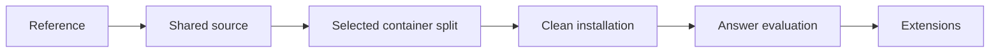

# Roadmap

[Home](README.md) · [Architecture](architecture/Architecture%20Concept.md) · [Validation](evaluation/VALIDATION.md)

Nora has a shared application package and a local source-release candidate. The current five-service stack passed an isolated ARM Linux installation and synthetic answer/recovery trial. The selected target adds per-role runtime containers, shared BGE and four manual ingestion jobs.

**Current priority:** package the combined source with sanity checks and reused receipts; deeper validation and controlled rollout remain separate. This ordering is recorded in [D170](Decisions.md#current-priority-cleanup-first-then-implementation-then-rollout).

## 1. Prepare public documentation — delivered 2026-09-14

Purpose and examples lead each guide. Concepts, procedures and results have owning pages. Public diagrams use Mermaid and editable Obsidian-native Excalidraw with matching SVG previews; private planning history is preserved separately. Contribution, licensing and source-publication guidance are included.

## 2. Consolidate and test source — delivered 2026-09-14

One Python package and one UI replace duplicate deployment code. Settings and credential files are explicit; deterministic preparation, validated imports and authenticated MCP share one representation. Synthetic fixtures, framework contract tests, a real BGE/MCP smoke test, pinned dependencies and a source allowlist support reproduction. [Validation](evaluation/VALIDATION.md) records the exact limits.

The local source candidate does not deploy the refactor or publish GitHub history.

## 3. Implement the selected container split and verify a clean installation

### Current five-service trial — passed 2026-09-14

1. **Passed:** build and start both images and all five services in an isolated Compose project on ARM Linux.
2. **Passed:** use Ollama Cloud `gpt-oss:20b` for a question, same-conversation follow-up, missing-evidence case and post-restore follow-up over three fictional documents.
3. **Passed:** preserve exact conversation history across PostgreSQL/Coordination restart and restore into a separate PostgreSQL instance with a fresh volume.
4. **Next:** exercise Tailscale access from an intended second device, correction behavior, operational resource limits and other target architectures.

The trial also checked host file ownership and configurable UI origins/MCP hostnames. [Validation](evaluation/VALIDATION.md) owns the measured scope. It does not establish general answer quality or a production deployment.

### Selected target implementation

The separate VM task records the earlier five-service 0.1.0 baseline as already deployed, with three example documents, Atlas answers/follow-up and history after browser refresh. Its deployed source archive SHA-256 is `40d1d121e173523492f50b70096fb2cf1ad08400b6b8107d015199503e98a8dc`. That is a recorded result from that task, not an independent host probe here; the new candidate in this checkout is distinct and not deployed. The next deployment is a controlled upgrade of that existing baseline, not a new VM or initial deployment. VM reboot recovery, full-corpus operation and the new architecture were not proven by browser refresh.

[D167](Decisions.md#selected-target-separate-runtime-and-job-containers) and [D169](Decisions.md#accepted-implementation-choices-from-the-architecture-review) select the target architecture and implementation choices. The [four diagrams](architecture/diagrams/README.md), [service inventory](setup/containers/README.md) and job contracts describe them. Per the current priority (D170), implementation starts after the GitHub-ready cleanup/review is complete. Work includes:

1. ✅ Add per-role runtime configuration and UI routing; keep Coordination and the Deep Agent together. Define role/thread checkpoint isolation and execution ownership.
2. ✅ Expose the pinned BGE model as a shared server; replace inline query and batch encoders with clients. Bound batch concurrency and add backpressure. Real interactive latency during imports remains unmeasured.
3. ✅ Split conversion, deterministic preparation, batch embedding and import/update into four job entrypoints and containers. Persist and validate their artifact handoffs; keep originals unchanged.
4. ✅ Extend Compose/build assets with the new services/jobs, mounts, credentials, health checks and resource limits. Shared images are allowed; container boundaries remain separate. Target capacity and operating limits remain unverified.
5. Activation and rollback are source-implemented and have synthetic receipts. Live publication, recovery, document deletion and interrupted-job recovery remain unverified.
6. Controlled clean-install rollout and representative quality measurement.

After the refactor, repeat clean-install verification for the new target:

1. Build and start the prepared Compose stack on a fresh target.
2. Select an available tool-capable answer model and test a question, follow-up, correction and missing-evidence case.
3. Check PostgreSQL conversation recovery across process restarts and a restore into fresh volumes.
4. Exercise private remote access, resource limits and host ownership with the same source snapshot.

The five-service stack trial remains evidence for that stack. The four-job/BGE/activation slice of the selected target is source-implemented and container-accepted. In this checkout the role-runtime slice is also source-implemented and reviewed: per-role runtime containers and UI routing for Research Assistant and Interview Analyst, role/thread checkpoint namespacing plus a global ownership table, and automatic quality-first routing across Ollama Cloud and Fireworks.ai. Role receipts include PostgreSQL 16 ownership tests and live Ollama/Fireworks text/authentication smoke. They do not establish PostgreSQL 17.9 target acceptance, live provider tool/stream behavior, GCS publication or rollout.

### First complete update-to-answer slice — delivered and independently reviewed 2026-09-14T14:23:44-04:00

This isolated checkout delivers and independently reviews the first runnable end-to-end slice of the selected target architecture before any production rollout. It is recorded as [D171](Decisions.md#first-complete-knowledge-update-to-answer-slice).

Delivered and verified in this slice:

1. **Persistent shared BGE HTTP service** with query/document mode, bounded batch size/concurrency and backpressure that preserves interactive query capacity.
2. **Four distinct temporary job containers** (`job-convert`, `job-prepare`, `job-embed`, `job-import`) and a host-side `scripts/knowledge-update` launcher that runs them in order, verifies stage manifests and atomically activates a new release.
3. **One operator command** (`nora knowledge-update`) that runs the four jobs, validates the bundle and atomically activates a new release.
4. **Coherent activation, rollback and release pinning**: failed or interrupted staging leaves the existing `current` symlink or cloud pointer unchanged; Retrieval reads the active release for both documents and index and pins one release for search/read within an answer turn via the `X-Nora-Release` header. Local mode uses a filesystem symlink; GCS mode uses a generation-conditional `gs://bucket/object` cloud pointer that Retrieval consumes.
5. **Source-level GCS support** for publishing release artifacts, generation-conditional cloud pointer activation/rollback and Retrieval reading that pointer to discover the active manifest and documents, with local `FakeGCSClient` verification.
6. **Compose/build and docs updates** for the BGE service, four job profiles and launcher, plus tests for handoffs, real HTTP shared-service calls, release isolation, failed activation, rollback, GCS publishing and bounded concurrency.

Remaining selected-target work after the role-runtime slice:

- Live provider tool/stream behavior; existing text/authentication smoke receipts are retained.
- PostgreSQL 17.9 target acceptance and downgrade/recovery; existing PostgreSQL 16 ownership receipts are retained.
- Dedicated GCS prepared-document bucket deployed and smoke-checked in a real cloud project.
- Controlled clean-install rollout and representative quality measurement.
## 4. Establish a representative quality baseline

1. Validate the six private regression labels against their intended corpus and inspect misses.
2. Add reviewed, held-out and negative cases beyond the three synthetic integration fixtures.
3. Measure retrieval, answer correctness, missing-evidence behavior, latency and cost separately.
4. Execute the [multi-turn plan](evaluation/Multi-turn%20Evaluation.md) with inspectable component results.

The earlier private regression measured Hit@1, Hit@5 and MRR@5 of 1/6. The three synthetic questions now score 3/3 under different data and test conditions; this is not a before/after quality comparison.

## 5. Evaluate routing and operations

The optional router's tool binding, synchronous/asynchronous calls, streaming and failure behavior are covered by contract tests. Compare routed and baseline answers, latency and actual provider usage before selecting models or thresholds. Its English keyword heuristic has no demonstrated general quality parity.

Add incremental document replacement/deletion, interrupted batch recovery, distributed conversation ownership and useful usage telemetry when needed. Current imports are idempotent for identical point sets and preserve a conflicting collection by requiring a new one. LangSmith remains a planned integration with trace content and retention undecided.

## 6. Extend when evidence supports it

Additional MCP clients, source routing, query refinement, research, specialist roles and voice remain candidates. Their adoption rationale lives in [Technology Choices](architecture/Technology%20Options.md#future-extensions). Knowledge, Research and Interview role runtimes are source-implemented, reusing shared retrieval, BGE and separate manual ingestion. Additional specialist tools remain separate scope.
