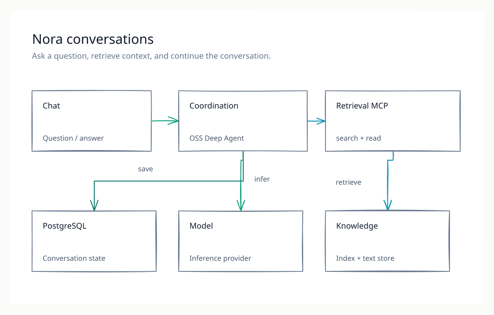
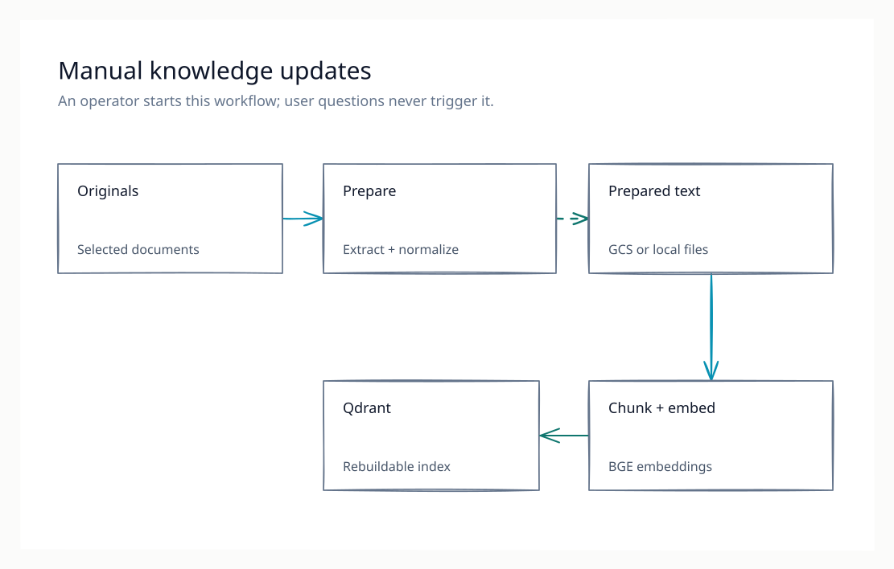

# Nora — Knowledge & Agent Harness

Nora is an experimental, self-hosted knowledge assistant. It searches a prepared document collection, answers questions through a Deep Agent, and saves conversations so they can continue across sessions.

**Example:** “What still blocks the Atlas release?” The included fictional project notes say that a load test and a rollback rehearsal remain. Nora retrieves those passages before answering or asking for clarification.

## How it works



[Edit the Excalidraw diagram](architecture/diagrams/conversation.excalidraw.md).

Nora is built from:

- One Python package that owns preparation, indexing, Retrieval MCP and Coordination.
- OSS Deep Agents with LangChain/LangGraph for the agent runtime.
- A Next.js browser UI using CopilotKit and AG-UI.
- BGE and Qdrant for shared dense/lexical retrieval.
- PostgreSQL for conversation checkpoints.
- Ollama Cloud and Fireworks.ai for answer inference.

The [selected target architecture](architecture/diagrams/README.md) gives each agent role its own runtime container and adds:

- Automatic balanced model routing across the three inference providers, inside each role runtime.
- A shared BGE server for query and document encoding.
- Four temporary job containers for manual ingestion.
- A dedicated GCS bucket for prepared full documents.
- Atomic release activation that advances prepared documents and the Qdrant index together, with rollback to the previous version.

The simpler illustrations here show concepts; the detailed views show container boundaries and current implementation gaps.

Normal answers are plain text; internal document IDs support reads, maintenance and evaluation.

## Knowledge updates

Document ingestion is a separate, manually invoked workflow. It preserves original files and prepares text and a rebuildable index for retrieval. User questions never start ingestion.



[Edit the Excalidraw diagram](architecture/diagrams/manual-ingestion.excalidraw.md) · [Ingestion workflow](workflows/ingestion/README.md).

## Try the source

Use Python 3.12 and Node.js 22.22 or newer. From the repository root:

```bash
python3.12 -m venv .venv
source .venv/bin/activate
python -m pip install -c requirements.lock -e '.[server,dev]'
npm --prefix ui ci
make validate
```

These checks use synthetic data and model doubles. To exercise the actual embedding model and MCP protocol, follow the [synthetic smoke test](setup/README.md#test-real-retrieval). To run the application, follow the [Compose setup](setup/README.md#run-the-application).

## Current maturity

| Area | State |
| --- | --- |
| Shared backend and one UI | Implemented; Python tests, TypeScript and production UI build checked |
| Real BGE and MCP retrieval | Three synthetic documents/questions pass the local smoke test |
| Selected container split (D167/D169/D172) | Implemented: shared BGE server, four job containers, per-role runtimes with automatic provider routing, checkpoint namespacing and thread ownership; real PostgreSQL/Docker and dedicated GCS bucket remain rollout work |
| Portable Compose configuration | Built and exercised on ARM Linux with synthetic Ollama answers and PostgreSQL recovery into fresh storage |
| Answer generation and PostgreSQL persistence | Implemented; this refactor was tested with a model double and an in-memory checkpointer |
| Optional model routing | Automatic quality-first routing implemented per role; quality/cost/latency weights are explicit assumptions awaiting measurement |
| Private reference deployment | Historical evidence retained; this source refactor has not been deployed there |

The small synthetic result is an integration check. It does not replace the failing six-query private regression or establish general answer quality. [Validation details](evaluation/VALIDATION.md) and the [roadmap](Plan.md) keep these scopes explicit.

## Explore and contribute

1. [Architecture](architecture/Architecture%20Concept.md) and [service inventory](setup/containers/README.md).
2. [Setup](setup/README.md), [source map](REPO_MAP.md) and [contributing](CONTRIBUTING.md).
3. [Evaluation](evaluation/README.md) and [architecture decisions](Decisions.md).
4. [Source release](PUBLISHING.md), [security](SECURITY.md) and [data contract](data/Source%20Inventory.md).

Nora uses the [MIT license](LICENSE). Preserve [upstream notices](NOTICE.md) and [Templates/LICENSE](Templates/LICENSE). The included examples are fictional MIT-licensed fixtures. Other documents, model weights and dependencies retain their own terms.
