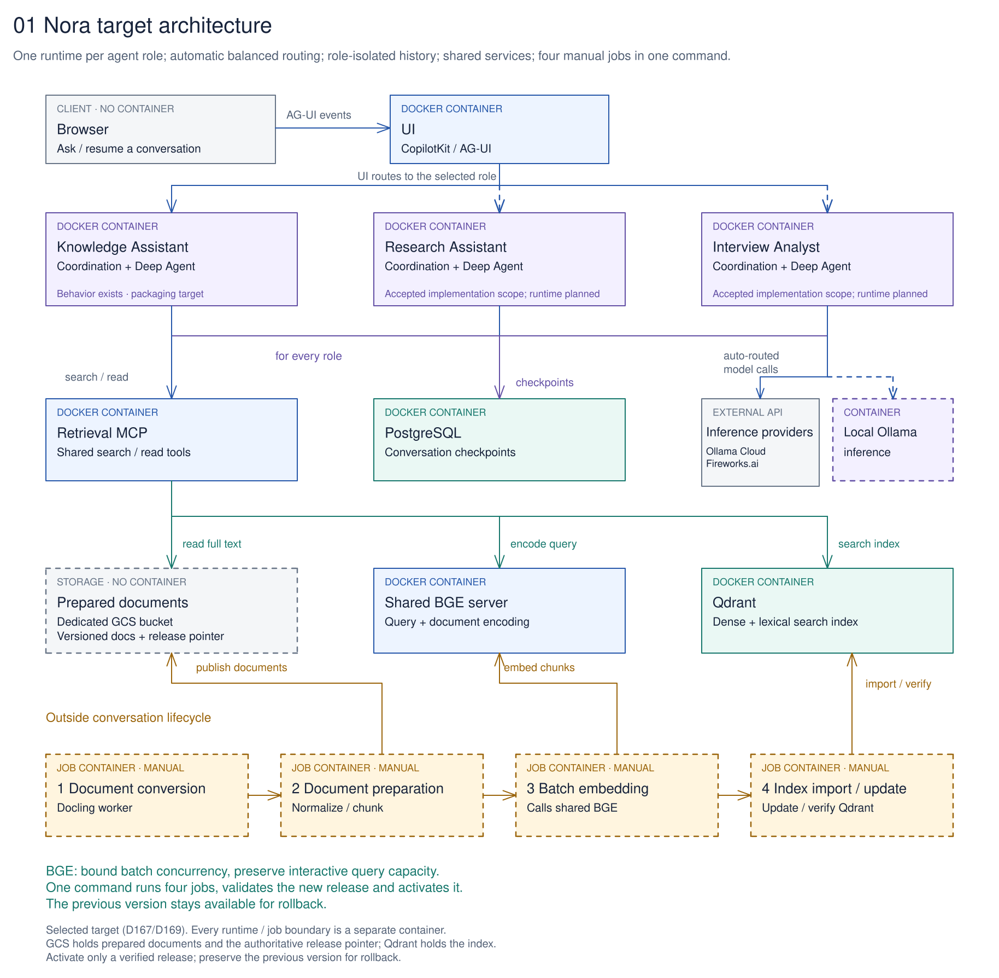
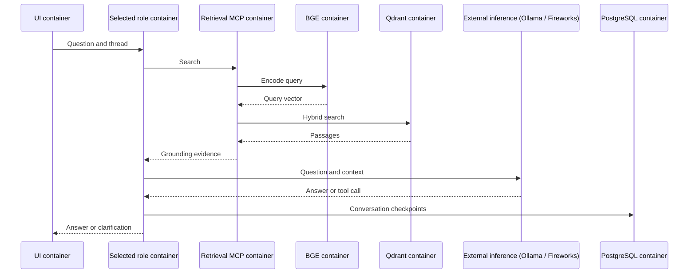

# Architecture

[Home](../README.md) · [Requirements](Requirements.md) · [Technology choices](Technology%20Options.md) · [Services](../setup/containers/README.md)

Nora separates conversation handling from knowledge retrieval and document preparation. A user asks one question; a shared retrieval service finds passages; an agent produces a plain answer and retains the conversation.

## Worked example

“Prepare a brief for the Atlas project handover.” The assistant should establish which project or handover the user means, retrieve relevant decisions and notes, and explain supported points and gaps. Exported documents are dated snapshots, so a saved calendar item alone cannot establish a current meeting.

## Selected target architecture

The selected target architecture separates:

- **One runtime container per enabled role**, containing Coordination and its Deep Agent. Knowledge Assistant behavior exists today; Research Assistant and Interview Analyst are accepted implementation scope after repository preparation.
- **Shared service containers**: UI, Retrieval MCP, shared BGE server, Qdrant and PostgreSQL each have their own container.
- **Automatic balanced routing** inside each role runtime across Ollama Cloud and Fireworks.ai.
- **Four temporary job containers** for manual knowledge updates: Docling conversion, deterministic preparation/chunking, batch embedding and index import/update.
- **A dedicated GCS bucket** for prepared full documents, separate from the Qdrant search index.

UI role routing, per-role packaging, role/thread checkpoint isolation and the shared BGE API still need implementation.

[Edit the system diagram](diagrams/01-system-architecture.excalidraw.md) · [All four diagrams](diagrams/README.md).

Manual knowledge updates use the four temporary job containers. One operator command starts all four in order, validates the result and activates the new release. Original documents stay unchanged. A release advances both prepared full documents and the matching Qdrant collection; the previous version remains available for rollback. The four jobs exchange durable artifacts outside conversations. Retrieval and the batch worker both call shared BGE; bounded batch concurrency protects interactive query encoding. [D167](../Decisions.md#selected-target-separate-runtime-and-job-containers) and [D169](../Decisions.md#accepted-implementation-choices-from-the-architecture-review) record the target design; the [service inventory](../setup/containers/README.md) owns the differences from current code.

## One request

The diagram summarizes the selected target request path. The current encoder is still inside Retrieval. The agent can make additional bounded knowledge calls; [the full conversation diagram](diagrams/02-question-to-answer.excalidraw.md) shows document reads and the optional tool cycle. Ingestion is separate and does not run in this sequence.

## Responsibilities

| Component | Owns |
| --- | --- |
| Interaction | CopilotKit browser UI, application-server routes and AG-UI messages/events |
| Each agent role runtime | Coordination with its OSS Deep Agent, model calls, bounded context, tools and conversation lifecycle |
| Shared Retrieval MCP | MCP `search`/`read`, calls to BGE for query encoding, Qdrant search and prepared-document reads |
| Shared BGE server | Query and document encoding; admission control for interactive and batch callers |
| Four document-processing jobs | Manual conversion, deterministic preparation, batch embedding and index import/update |
| Qdrant | Dense and lexical search index with internal document metadata |
| PostgreSQL | LangGraph conversation checkpoints |

Deep Agents is the harness, LangChain supplies model/tool abstractions, and LangGraph supplies execution and state machinery. These libraries run together inside each role runtime. Coordination does not wrap the Deep Agent in a second custom agent loop.

## Storage roles

Original files remain in operator-controlled storage. The shared store reads a local document directory or generation-pinned GCS objects. Qdrant is the rebuildable search index, and PostgreSQL holds conversation state. Neither database uses an object-storage mount for live files.

The [data contract](../data/Source%20Inventory.md) owns document identity and prepared artifacts. The [service inventory](../setup/containers/README.md) owns packaging and network details.

## Retrieval and answer behavior

The shared implementation combines dense BGE retrieval with a hashed lexical representation and reciprocal-rank fusion. It deduplicates results by document. The earlier local BM25 experiment is a separate implementation and dataset.

Coordination performs an initial knowledge search for each turn. Its tools allow additional search and document reads. Source text is reference material, not instructions to execute. Normal answers omit citation cards and internal IDs; those IDs remain available internally for maintenance and evaluation.

Plain-answer formatting is an application choice, not evidence that an answer is grounded. Correctness, missing-evidence behavior and context selection need their own tests.

## Conversation state and recovery

The implementation uses the official LangGraph PostgreSQL checkpointer and stable thread identifiers. Browser history and checkpoints are different stores. Checkpoint persistence does not by itself demonstrate clean-target restoration, crash behavior or exactly-once effects.

Read the dated [deployment status](../setup/private-deployment/STATUS.md) and [multi-turn evaluation plan](../evaluation/Multi-turn%20Evaluation.md) for what is measured and what remains open.

## Clients and extensions

Nora's Coordination service uses Retrieval MCP today. Other clients should reuse that contract with appropriate authentication and permissions. [OpenClaw integration](OpenClaw%20Integration.md) remains a separate compatibility and authorization task.

The shared package includes an optional experimental model router. Additional source routing, relevance/query-refinement loops, research roles and voice remain [future extensions](Technology%20Options.md#future-extensions).

## Source layout

Executable application code lives in one `src/nora/` package and one `ui/`. Root Compose and `deploy/` own current packaging; target guides refer to the same source. D167 still requires per-role configuration, a shared BGE API, four job entrypoints and their container definitions.

[Agents](../agents/README.md) owns the selected per-role container design and the planned package organization for additional roles. A role directory is not a deployed service, and a container is not necessarily an agent.
