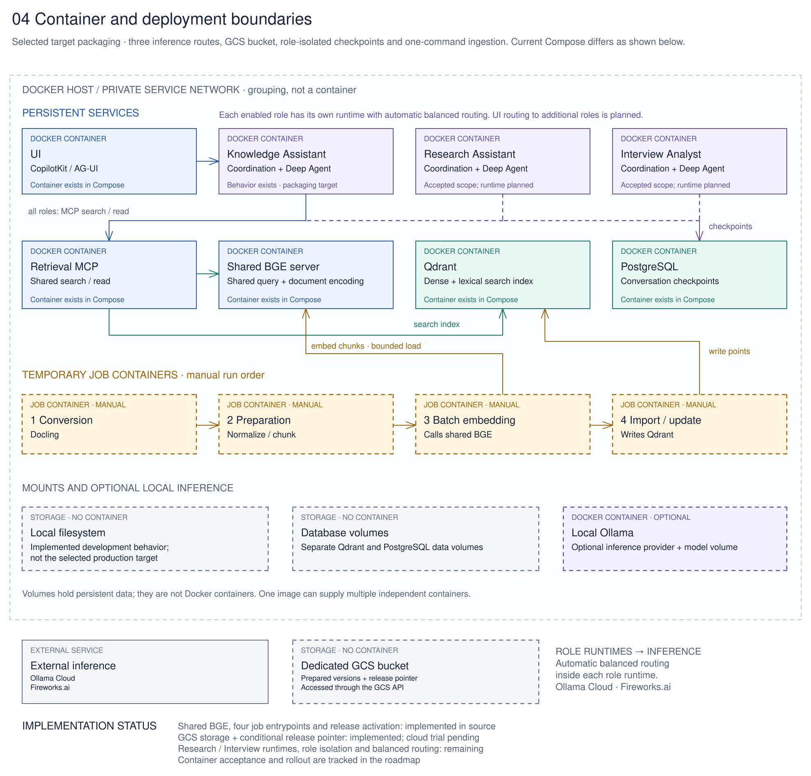

# Deployment boundaries

[Architecture](Architecture%20Concept.md) · [Service inventory](../setup/containers/README.md)

The selected target gives each agent role its own runtime container with automatic balanced model routing, and shares knowledge infrastructure across roles. For example, the Knowledge Assistant and the accepted-future Research Assistant use the same Retrieval MCP and BGE services while keeping their execution and conversation lifecycle in their respective runtimes.

[Edit this diagram](diagrams/04-deployment-views.excalidraw.md).

Each role contains Coordination and the Deep Agent together. UI, Retrieval MCP, BGE, Qdrant and PostgreSQL each have separate containers. Four temporary ingestion containers run only on an operator's command. Their artifacts persist outside the jobs. There is no separate custom outer coordinator.

A shared source package or image can supply several independent containers. This preserves `src/nora/` and `ui/` as shared source without imposing a single runtime process. The host/network rectangle in the diagram is a deployment grouping; actual host placement can differ.

External inference routes are Ollama Cloud and Fireworks.ai. Optional local Ollama is a separate container. Prepared full documents use a dedicated GCS bucket in the selected target (local filesystem in current development); database volumes and managed storage are not containers. Qdrant stores the search index, while PostgreSQL stores conversation checkpoints.

## Difference from current Compose

[Current Compose](../compose.yaml) has one Coordination role and no shared BGE server. Retrieval and preparation load BGE locally; the host CLI performs preparation, and the `admin` profile supports import/verification. The four job containers and additional role runtimes are selected design work, not implemented packaging.

The [service inventory](../setup/containers/README.md) owns the complete list, storage and BGE contention policy. [D167](../Decisions.md#selected-target-separate-runtime-and-job-containers) records the selection; the [roadmap](../Plan.md#3-implement-the-selected-container-split-and-verify-a-clean-installation) owns required implementation and clean-install checks.
