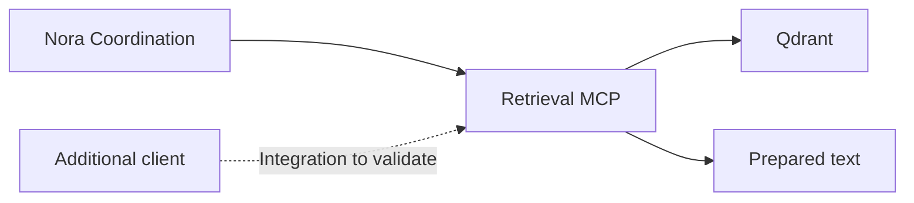

# Additional MCP clients

[Architecture](Architecture%20Concept.md) · [Retrieval contract](../setup/containers/knowledge-retrieval.md)

OpenClaw and other MCP-capable applications can be considered as clients of Nora's Retrieval service. The intended benefit is shared prepared knowledge without a second index.

The solid path is implemented in the reference application. The additional-client path requires its own endpoint, authentication, transport and result-compatibility validation.

## Integration responsibilities

1. Establish private network reachability to the intended Retrieval endpoint.
2. Configure the client using its supported MCP mechanism and the intended credential.
3. Verify initialization, `search`, bounded `read`, errors and timeouts with synthetic material.
4. Test the client's allowed source coverage and credential isolation.
5. Keep ingestion, direct database access and external actions outside this knowledge-tool integration.

The current shared bearer boundary does not implement a per-user source authorization system. A private endpoint alone does not establish permission isolation between several clients.

## Existing helper and limits

Configure an intended client with the shared MCP endpoint, its bearer credential and an explicit access route. No client configuration is modified by the source package. External MCP client acceptance tests remain to run; the original operator-specific connection helper is preserved outside the public release.

Client-specific gateway control, voice and provider configuration belong to the client application. Consuming Nora's MCP tools does not make that client the owner of Nora's conversation runtime or ingestion jobs.
