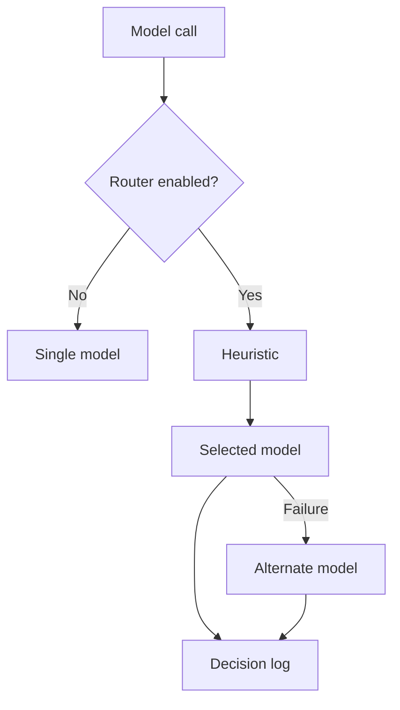

# Technology choices

[Architecture](Architecture%20Concept.md) · [Decisions](../Decisions.md) · [References](Research%20and%20Design%20Inputs.md)

Nora uses existing agent and data infrastructure so the project can focus on document quality, retrieval, conversation behavior and operations.

## Implemented foundation

| Role | Technology | Current use |
| --- | --- | --- |
| Agent harness | OSS Deep Agents | Agent construction and configured capabilities inside Coordination |
| Framework/runtime | LangChain and LangGraph | Model/tools, middleware, execution and checkpoints |
| Interaction | CopilotKit and AG-UI | Browser chat and event transport |
| Extraction | Docling plus direct text readers | Supported document conversion and deterministic preparation utilities |
| Query/document vectors | BAAI/bge-base-en-v1.5 | Pinned self-hosted English embedding model; 768-dimensional normalized vectors |
| Retrieval | Qdrant | Dense and hashed lexical search with rank fusion in the shared Retrieval service |
| Conversation persistence | PostgreSQL | Official LangGraph Postgres checkpointer |
| Answer inference | Ollama, Fireworks.ai | Two provider routes; automatic balanced routing inside each role runtime (selected target) |
| Prepared text | Dedicated GCS bucket (selected); local files (current dev) | One store interface with explicit configuration; GCS is the selected production target |

Dependency versions are pinned in `pyproject.toml`, `requirements.lock` and the UI lockfile. The small historical embedding comparison informed the BGE choice; it does not establish multilingual or corpus-wide quality.

## Model-provider routing

The selected target runs automatic balanced routing inside each role runtime across Ollama Cloud and Fireworks.ai. The routing objective is to meet required quality first, then balance cost and latency among eligible models. This is distinct from the currently implemented optional heuristic, which only delegates between two Ollama-compatible models using prompt length and English keyword matches.

### Current implemented heuristic (experimental, disabled by default)

The shared `RoutingChatModel` delegates to two Ollama-compatible models using prompt length and English keyword matches. It supports tool binding, synchronous/asynchronous calls and streaming through public LangChain interfaces. It is disabled by default.

LiteLLM is a possible gateway and RouteLLM a learned-routing reference. Neither is installed. MT-Bench informs judge methodology; no answer judge or quality gate is implemented in the current router.

Fallback can move in either direction, once before any output is emitted. Partial stream failure raises without switching models, and a telemetry write failure cannot trigger another model call. Adapter contracts and credential separation are tested with doubles. Actual cost, quality, multilingual routing and remote cancellation remain to evaluate.

See the [routing reference](../setup/model-routing.md) for exact fields and limitations. Routing remains disabled by default.

## Checkpoints and recovery

PostgreSQL stores conversation checkpoints. The current five-service trial verified that exact conversation history is preserved across PostgreSQL/Coordination restart and can be restored into a fresh PostgreSQL volume; see [evaluation/VALIDATION.md](../evaluation/VALIDATION.md). A separate cross-thread application-memory store has not been selected. Role/thread checkpoint isolation for the selected multi-role target, distributed concurrency ownership and crash behavior remain to implement and test; a database connection alone does not settle them.

## LangSmith and Studio

LangSmith is selected for tracing, datasets, experiments and comparisons. Studio is developer tooling, while CopilotKit remains the user interface. Configuration, data retention and connection verification remain open. No managed agent hosting or sandbox service is implied.

## Future extensions

| Candidate | Useful when | Work needed |
| --- | --- | --- |
| Source routing | Reviewed questions benefit from source-specific searches | Coverage-aware filters, branch budgets and partial-result behavior |
| Relevance/query refinement | Useful indexed passages are repeatedly missed | A bounded reformulation loop tested against unchanged fixtures |
| Research Assistant | Saved knowledge cannot answer a question | Accepted implementation scope after repository preparation; chosen external tools, scoped investigation and result evaluation |
| Interview Analyst | Supplied preparation and feedback need comparison | Accepted implementation scope after repository preparation; file/transcript handling and role-specific criteria |
| On-demand skills or delegation | Distinct procedures exceed a single role's useful context | Explicit tool and state boundaries; measurable benefit |
| Voice | Spoken interaction becomes a supported experience | Input/output providers, language handling, interruption and physical tests |
| Additional MCP clients | More applications need the same prepared knowledge | Client configuration, permission isolation and interoperability tests |
| GKE or broader distribution | A measured deployment need exceeds one host | Service discovery, per-thread ownership, storage and recovery design |
| Harbor/Terminal-Bench | A suitable task needs environment-level evaluation | A Nora-compatible adapter and explicit evaluation boundary |

These are candidates, not hidden features. Keep the current knowledge path stable and choose extensions against concrete scenarios.
