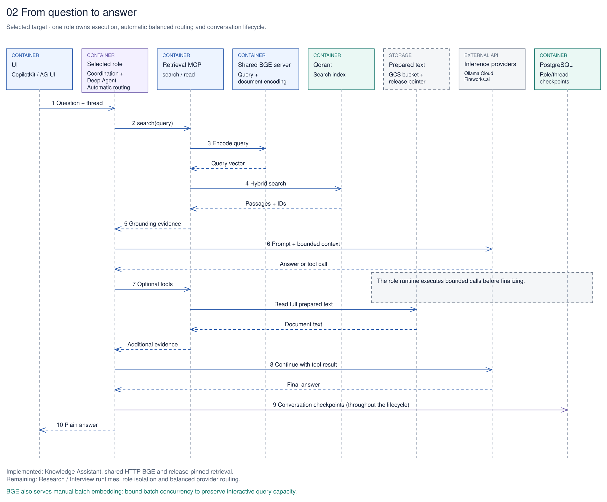
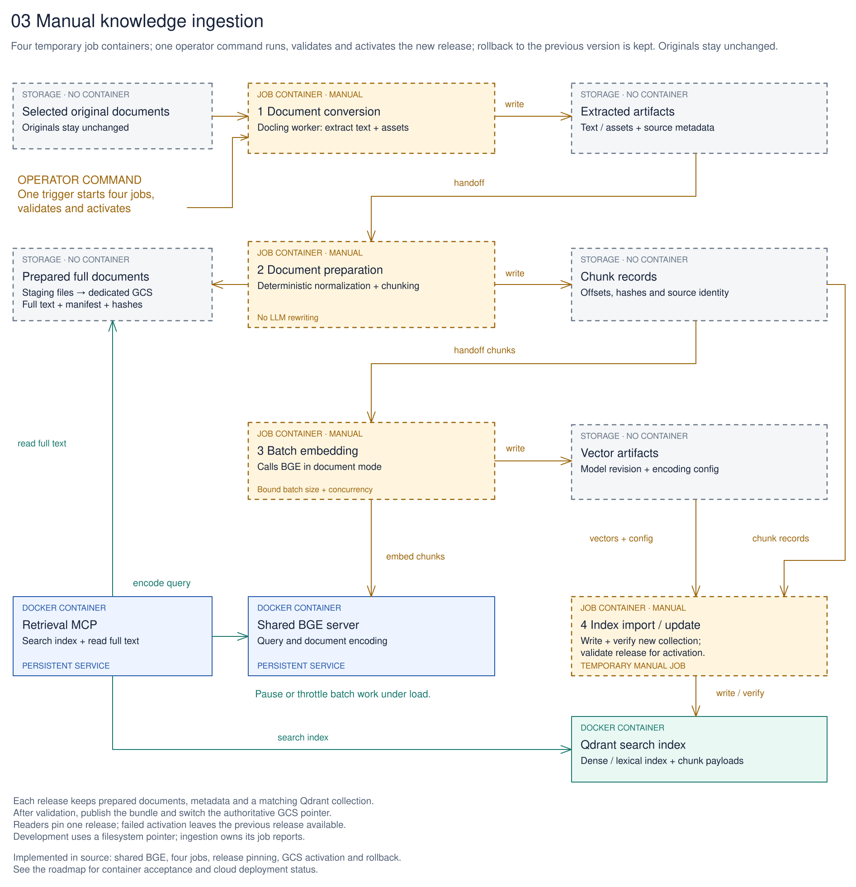

# Editable architecture diagrams

These four views explain the selected target in [D167](../../Decisions.md#selected-target-separate-runtime-and-job-containers) and [D169](../../Decisions.md#accepted-implementation-choices-from-the-architecture-review). They distinguish current behavior from target packaging and roles; they do not claim a new deployment.

| View | Editable source | Matching preview |
| --- | --- | --- |
| System architecture | [01 — Nora target architecture](01-system-architecture.excalidraw.md) | [SVG](01-system-architecture.svg) |
| Conversation | [02 — From question to answer](02-question-to-answer.excalidraw.md) | [SVG](02-question-to-answer.svg) |
| Ingestion | [03 — Manual knowledge ingestion](03-manual-ingestion.excalidraw.md) | [SVG](03-manual-ingestion.svg) |
| Containers and deployment | [04 — Container boundaries](04-deployment-views.excalidraw.md) | [SVG](04-deployment-views.svg) |

Open the `.excalidraw.md` source with Obsidian's Excalidraw plugin or the Codex local Excalidraw preview. Shapes, text and arrows are editable. Each SVG is an export of its matching source.

Blue and purple boxes represent persistent application/role containers; teal represents database containers; dashed amber boxes are temporary manual-job containers. Gray boxes identify storage or external services, explicitly labeled. Dashed role routes indicate planned integration; sequence return arrows are also dashed and point back to their caller.

Knowledge Assistant behavior exists. Research Assistant and Interview Analyst are accepted implementation scope after repository preparation. Per-role configuration, automatic balanced routing, the dedicated GCS bucket, the shared BGE API and four worker containers differ from [current Compose](../../compose.yaml). Exact resource limits and role isolation remain implementation work. [The service inventory](../../setup/containers/README.md) owns the complete comparison.

The conversation view shows one optional tool cycle; further calls remain bounded. Checkpoints belong to the whole conversation lifecycle. Ingestion owns independent job results and never starts from a question. Both Retrieval and batch embedding call shared BGE; batch concurrency must preserve interactive capacity.

Sources: [architecture](../Architecture%20Concept.md), [manual workflow](../../workflows/ingestion/README.md), [roles](../../agents/README.md), [service inventory](../../setup/containers/README.md), and [roadmap](../../Plan.md).

The root README retains its simpler conceptual [conversation](conversation.svg) and [ingestion](manual-ingestion.svg) illustrations, with editable [conversation](conversation.excalidraw.md) and [ingestion](manual-ingestion.excalidraw.md) sources. Those conceptual views do not specify container placement; the four views above own the selected boundaries.
