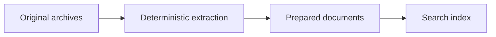

# Collection and categorization history

[Data contract](../data/Source%20Inventory.md) · [Manual ingestion](../workflows/ingestion/README.md)

Earlier Nora work collected and classified a private archive into source families. That process is historical context for the current prepared-document workflow; it is not an automatic collector shipped with the application.

The public package starts with a selected local document directory. Its [preparation module](../src/nora/preparation.py) decodes supported mail exports, preserves substantive text, omits unusable material and exact duplicates, chunks by token offsets and records exclusions. No LLM classification or summary is performed.

Original provider dispatchers, Drive collection code, classification configuration and run receipts are preserved outside the public release. They contain operating assumptions and private inputs that are unnecessary for reproducing the application with fictional data.

The [historical cleanup results](RESULTS.md) remain readable. [Shared setup](../setup/README.md) owns current commands; no watcher, scheduled collection or query-triggered ingestion is installed.
