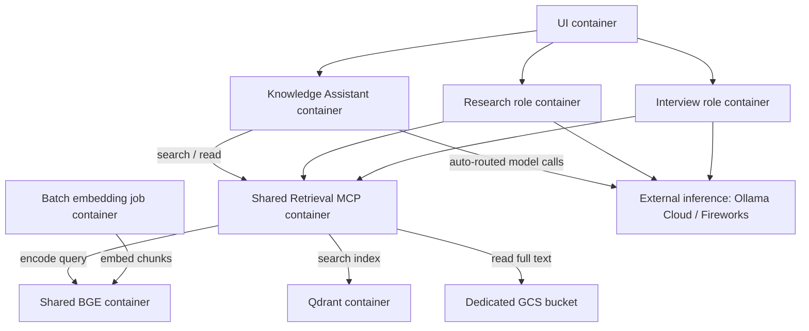

# Container and service inventory

[Home](../../README.md) · [Architecture](../../architecture/Architecture%20Concept.md) · [Setup](../README.md)

A question goes from the UI to one agent role, then through shared Retrieval MCP to the knowledge services. Each role runtime performs automatic balanced model routing across the configured inference providers. An operator updates knowledge through four separate jobs triggered by one command that validates and activates a new release. This page owns the selected container boundaries and their difference from [current Compose](../../compose.yaml). The selections are recorded in [D167](../../Decisions.md#selected-target-separate-runtime-and-job-containers) and [D169](../../Decisions.md#accepted-implementation-choices-from-the-architecture-review).

## Selected target

Every row below is a separate Docker container. A role runtime contains both Coordination and its Deep Agent; there is no additional outer coordinator.

| Container | Lifecycle | Responsibility | Current implementation / target gap |
| --- | --- | --- | --- |
| [UI](ui.md) | Persistent service | CopilotKit / AG-UI; send a conversation to its selected role | UI container exists; multiple-role routing planned |
| [Knowledge Assistant runtime](coordination.md) | Persistent service | Coordination + Deep Agent + conversation lifecycle | Implemented as the existing `coordination` service serving the `knowledge` role |
| [Research Assistant runtime](../../agents/README.md#research-assistant) | Persistent service when enabled | Its own Coordination + Deep Agent | Implemented as `role-research` |
| [Interview Analyst runtime](../../agents/README.md#interview-analyst) | Persistent service when enabled | Its own Coordination + Deep Agent | Implemented as `role-interview` |
| [Retrieval MCP](knowledge-retrieval.md) | Shared persistent service | `search` / `read` for all roles and intended clients | Container exists; calls shared BGE service for encoding |
| Shared BGE server | Shared persistent service | Query encoding and document embedding with `BAAI/bge-base-en-v1.5` | Implemented (`bge` service) |
| Docling conversion worker | Temporary manual job | Convert selected originals to text/assets and source metadata | Implemented (`job-convert` service) |
| Deterministic preparation worker | Temporary manual job | Normalize, deduplicate, preserve full text and chunk | Implemented (`job-prepare` service) |
| Batch embedding worker | Temporary manual job | Call shared BGE for chunks; persist vectors and encoding metadata | Implemented (`job-embed` service) |
| Index import/update worker | Temporary manual job | Import chunks/vectors into Qdrant and verify the result | Implemented (`job-import` service) |
| [Qdrant](qdrant.md) | Shared persistent service | Rebuildable dense and lexical index | Separate container and data volume exist |
| [PostgreSQL](postgresql.md) | Shared persistent service | Conversation checkpoints for all enabled roles | Separate container exists; role/thread isolation remains to implement |
| Optional local Ollama | Optional persistent service | Local answer inference when explicitly configured | Separate `local-model` profile exists |

With only the Knowledge role enabled, the target has six persistent containers and four job containers. Enabling both planned roles adds two persistent containers. Optional local Ollama adds one more. These counts describe the target, not running containers.

[Editable deployment view](../../architecture/diagrams/04-deployment-views.excalidraw.md) · [SVG preview](../../architecture/diagrams/04-deployment-views.svg). The [ingestion workflow](../../workflows/ingestion/README.md) owns job order and artifacts; [packaging](ingestion.md) owns worker boundaries.

## Shared BGE capacity

Retrieval calls BGE in query mode; the batch worker calls it in document mode. Both use the same pinned model revision, vector dimensions, normalization and compatible input limits. Query instructions remain specific to query encoding.

Bound batch size, outstanding requests and worker concurrency. The shared service needs admission control that preserves interactive capacity and applies backpressure to batch callers; jobs must throttle or pause under load. The exact limits, priority mechanism, timeout and retry policy require measurement. Test query latency during an import before enabling concurrent use.

## Storage and inference outside container boundaries

| Resource | Owner and purpose | Placement |
| --- | --- | --- |
| Original documents | Operator; unchanged source versions | Existing source storage |
| Prepared full documents and manifest | Preparation; full text and source identity for Retrieval `read` | Dedicated GCS bucket (selected target) |
| Extracted text, chunks, vectors and job reports | Manual ingestion; durable stage handoffs and recovery evidence | Job artifact storage, mounted or accessed by API |
| Search index | Qdrant; derived data rebuildable from prepared artifacts | Qdrant data volume |
| Conversation checkpoints | PostgreSQL; independent from ingestion state | PostgreSQL data volume |
| BGE model files | Shared BGE server; pinned model and receipt | Model cache volume |
| Ollama Cloud | External answer inference route | Provider API outside the Docker host |
| Fireworks.ai | External answer inference route | Provider API outside the Docker host |

GCS and filesystem/database volumes are storage, not Docker containers. The selected target uses a dedicated GCS bucket for prepared full documents; local filesystem support remains the implemented development behavior. Original documents, prepared full text, vectors and the live search index have distinct lifecycles. No ingestion broker or scheduler is selected.

## Current implementation

Root Compose defines eight default persistent containers: ui, coordination (Knowledge Assistant), role-research, role-interview, retrieval, bge, postgres and qdrant. The existing `coordination` service serves the Knowledge Assistant role directly; there is no separate `role-knowledge` container. Four distinct temporary job services (job-convert, job-prepare, job-embed, job-import) live under the ingestion profile; the host-side scripts/knowledge-update launcher runs them in order, verifies their manifests and activates the new release atomically. The admin profile still supports verification; optional ollama uses local-model.

The retrieval service calls the shared bge service for query encoding. The batch embedding job calls the same service in document mode. Both modes share the pinned model revision, dimension and normalization; query instructions are applied only in query mode.

Prepared full documents use the local filesystem in this slice. The dedicated GCS bucket selected in D169 is the production target and is supported at the source level through a generation-conditional cloud activation pointer (`gs://bucket/object`) that Retrieval consumes. A `FakeGCSClient` double supports local verification. A real GCS bucket, credentials and upload smoke check remain external.

The backend image is shared by Coordination, Retrieval and admin, while their containers remain independent. Current mounts include `.runtime/data`/`NORA_RELEASES_ROOT`, `.runtime/models/bge`, `.runtime/state` for the Coordination request counter, and `.runtime/secrets` mounted where needed. `scripts/docker_acceptance.sh` provides a bounded, unique-project acceptance run that starts only the services needed for the four-job pipeline and cleans up its own resources.

Current Compose publishes only UI 8080 and Retrieval 8001 on host loopback. Coordination and both databases stay internal. Tailscale is the selected private communication path (D168); [setup](../README.md#private-access-with-tailscale) owns the access configuration. A connection from another Tailscale device remains to test. Automatic balanced provider routing is implemented inside each role runtime. Dedicated GCS deployment remains rollout work. Existing single-user credentials do not establish multi-user isolation.

[Configuration](../configuration.md) owns current settings, [setup](../README.md#run-the-application) owns current commands, and [packaging status](STATUS.md) records the passed ARM Linux trial and fresh-volume PostgreSQL restore for the current five-service stack. Those results do not validate the new target split. The [roadmap](../../Plan.md#3-implement-the-selected-container-split-and-verify-a-clean-installation) lists the remaining target work.
