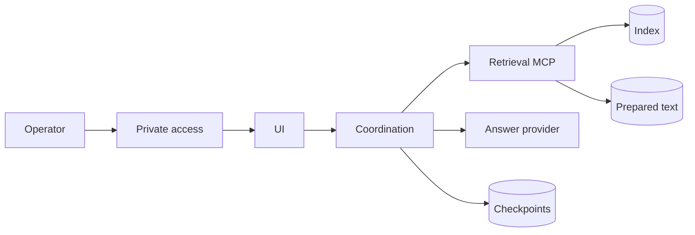

# Private reference deployment

[Setup](../README.md) · [Historical status](STATUS.md) · [Operations](ROLLOUT.md)

The original private deployment established a browser-to-agent-to-retrieval path with separate knowledge and conversation stores. Its dated evidence is retained as history. The September 14 shared-source refactor has not been deployed into that installation.

New installations use [one Compose configuration](../../compose.yaml), [one backend](../../src/nora/coordination.py) and [one UI](../../ui/package.json). Prepared text can be local or read from generation-pinned GCS objects. The default answer provider remains Ollama Cloud.

Original cloud provisioners, deployment wrappers, raw inventory, private fixtures and duplicated application files are retained in the maintainer's private preservation archive. They are not another supported public install path. The configurable [cloud foundation CLI](../google-cloud/CLI.md) remains available for an explicitly selected infrastructure stage.

Use [shared setup](../README.md) for a fresh target. Before moving an existing installation to this package, verify its data format, model representation, credentials, collection and PostgreSQL schema on a separate target. Existing runtime receipts do not establish compatibility with a new source candidate.
