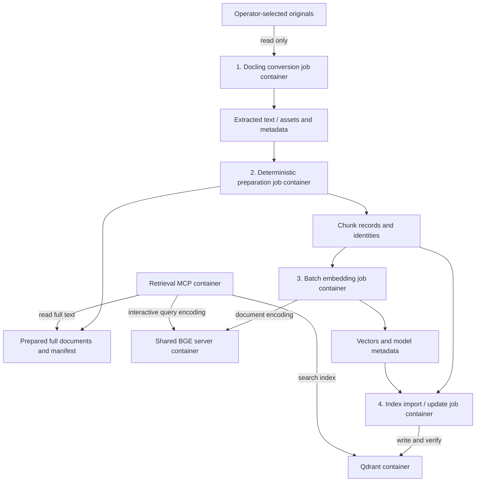

# Manual ingestion

[Architecture](../../architecture/Architecture%20Concept.md) · [Data contract](../../data/Source%20Inventory.md) · [Batch packaging](../../setup/containers/ingestion.md)

Prepare selected documents for retrieval when an operator runs a knowledge-update job. For example, add a revised project decision without changing its original file or making a conversation responsible for the import.

## Selected target workflow



[Detailed editable pipeline](../../architecture/diagrams/03-manual-ingestion.excalidraw.md) · [SVG preview](../../architecture/diagrams/03-manual-ingestion.svg).

Each numbered stage is a separate temporary Docker container. The operator manually starts the run with one command that runs the four stages in order, validates the result and activates the new version; stages also execute through their completed artifacts. Questions, folder changes and conversation Coordination do not start these jobs. Exact launch commands and job-state persistence remain implementation choices; no scheduler or broker is selected. [D167](../../Decisions.md#selected-target-separate-runtime-and-job-containers) and [D169](../../Decisions.md#accepted-implementation-choices-from-the-architecture-review) record the selected workflow.

| Stage | Input | Durable output |
| --- | --- | --- |
| 1. Docling conversion | Selected original versions, read only | Extracted text/assets and source metadata |
| 2. Deterministic preparation | Extraction artifacts | Full prepared documents and manifest; normalized chunk records with stable identities, hashes and offsets |
| 3. Batch embedding | Chunk records | Vectors associated with chunk IDs; pinned model revision and encoding configuration |
| 4. Index import/update | Chunks, vectors and manifests | Qdrant points and an independent verification/job report |

The selected target uses a dedicated GCS bucket for prepared full documents; the current development implementation uses local filesystem storage. Retrieval reads full text from that store independently of Qdrant's search index. A release advances both together: a new version of prepared full documents and a matching Qdrant collection are validated before activation, and the previous version remains available for rollback. Intermediate files and volumes survive the worker containers; they are storage, not additional containers. The table defines logical artifacts, not new implemented filenames.

The batch worker and Retrieval both call the shared BGE server. Bound batch size, concurrent requests and outstanding work; retain capacity for interactive queries and throttle or pause batch work under load. Model revision, dimensions and normalization must agree, with the appropriate query/document encoding mode. [The service inventory](../../setup/containers/README.md#shared-bge-capacity) owns this shared capacity contract.

## Activation and rollback handoff

One operator command starts the four job containers in order. After the import/verify job confirms point identity, counts and the matching prepared-document manifest, the command atomically activates the new dataset version:

1. The new prepared full documents become the active generation for Retrieval `read`.
2. The new Qdrant collection becomes the active search index.
3. The previous prepared-document generation and Qdrant collection remain untouched for rollback.

A failed or rejected import leaves the active version unchanged. Documents and the search index advance together; switching the index alone does not switch document reads. In GCS mode the active release is the authoritative cloud pointer; rollback rewinds that pointer using a generation precondition.


Ingestion has its own job result. It is outside the conversation graph and is not triggered by user questions.

## Current implementation

The [CLI](../../src/nora/cli.py) provides the operator command and four job entrypoints for the implemented slice. `nora knowledge-update` runs `nora job convert`, `nora job prepare`, `nora job embed` and `nora job import` in order, validates the bundle and activates the new release. Each job writes a manifest or report and refuses to consume incomplete stage artifacts. Preparation creates a new self-contained bundle and refuses to overwrite an existing output. The batch embedding job calls the shared BGE HTTP service in document mode. Unsupported, unreadable and empty inputs are accounted for; the original bytes remain unchanged.

The implemented slice uses local filesystem storage for prepared documents in development and tests, and supports source-level GCS activation through a generation-conditional cloud pointer. The dedicated GCS bucket selected in [D169](../../Decisions.md#accepted-implementation-choices-from-the-architecture-review) remains the production deployment target; a real bucket, credentials and upload smoke check are not included here. Per-role runtime containers and automatic balanced model routing across providers remain accepted future work.

Follow [shared setup](../../setup/README.md#run-the-application) for commands. Historical cloud cleanup and collection code is preserved separately.

## Verification commands

Run the conversion image against a synthetic DOCX:

```bash
PYTHONPATH=src:.venv/bin/python scripts/verify_conversion_image.py
```

Run the bounded Docker acceptance (requires Docker outside the sandbox):

```bash
NORA_PYTHON=.venv/bin/python scripts/docker_acceptance.sh
```

The acceptance script builds the backend and conversion images, starts `qdrant` and a deterministic-double BGE service, exposes `retrieval` on a loopback-only port, runs the actual four-job launcher through `scripts/knowledge-update`, verifies search/read and an agent answer through the live MCP boundary, exercises rollback, and cleans up only its own project resources.

## Processing contract

1. Select source versions and preserve originals.
2. Extract readable text with Docling or a direct reader.
3. Normalize deterministically; omit empty/unreadable content, exact duplicates, OS metadata and obvious repeated boilerplate from derived data.
4. Preserve headings and substantive text. Do not generate source summaries or rewrite meaning.
5. Chunk within the embedding model's complete input limit, including special tokens and query instructions where applicable.
6. Retain text, stable identities, hashes and model configuration with vectors.
7. Import and independently compare document/point identity and counts.

Each stage must validate its input manifest before consuming completed artifacts; restart, partial-failure recovery and safe activation still need implementation. An embedding cache can exist before a server index. A generated vector file alone does not establish a successful import.


## Implemented operator commands and activation mechanism

This checkout implements the first end-to-end slice of the selected workflow.

Host-only command:

```bash
nora knowledge-update <source-dir> <releases-root>
```

Docker-aware launcher:

```bash
scripts/knowledge-update <source-dir> [<releases-root> [<collection>]]
```

The Docker launcher starts four distinct temporary containers in order: `job-convert`, `job-prepare`, `job-embed` and `job-import`. Each job validates its input manifest, writes completed artifacts to the release directory and records its own job report. The launcher verifies artifacts between stages and stops before activation on any failure. After import/verify succeeds, activation advances both the prepared documents and the Qdrant collection together.

Local mode (default) atomically replaces a `current` symlink under the releases root. GCS mode requires `NORA_GCS_POINTER` (e.g. `gs://example-prepared-bucket/releases/current.json`), matching `NORA_GCS_BUCKET` and an explicit `NORA_GCS_PREFIX`. The launcher then runs a fifth activation step inside the existing `admin` container:

```bash
NORA_GCS_POINTER=gs://example-prepared-bucket/releases/current.json NORA_GCS_BUCKET=example-prepared-bucket NORA_GCS_PREFIX=releases NORA_GCS_PUBLISHER_CREDENTIALS_FILE=/path/to/publisher-adc-credentials.json NORA_GCS_PROJECT=example-gcp-project   scripts/knowledge-update ./source-documents
```

That file is mounted read-only at `/run/secrets/gcs-publisher` for the activation container only; Retrieval and the four job containers do not receive it. The activation command publishes prepared documents to `gs://<bucket>/<prefix>/<release-tag>/docs/<sha256>.txt`, writes a generation-pinned manifest to `gs://<bucket>/<prefix>/<release-tag>/manifest.json`, and conditionally updates `NORA_GCS_POINTER`. `NORA_GCS_BUCKET` must equal the bucket in `NORA_GCS_POINTER` because `activate_cloud` uses one bucket for both publication and the pointer. The launcher rejects GCS mode before any upload side effects if the bucket, prefix or publisher credential file is missing.

A failure before activation leaves the active release unchanged. In GCS mode the pointer write precedes local history and symlink updates; a failure after the pointer write can leave those local records stale and requires reconciliation. Retrieval resolves `current` (or the cloud pointer) on each request and also honors an `X-Nora-Release` header so that search and read within one answer turn pin the same release even if another release activates during the turn. Writes to GCS and Qdrant are not transactional; the symlink or cloud pointer is the single source of truth and is updated only after import/verify has confirmed point identity, counts and the matching manifest.

Rollback follows the selected storage mode. Local rollback activates the previous release from `.history`. Cloud rollback activates the previous entry from `.history-gcs`, rewinding the authoritative pointer with a generation precondition and also restoring the local `current` symlink to the matching release directory. Cloud rollback requires at least two recorded cloud activations and their retained local release directories. First cutover from the five-service/local baseline needs its separately saved deployment configuration, data and pointer state; this rollback command does not reconstruct that baseline.

This slice uses the local filesystem for prepared full documents in development and tests, and supports source-level GCS activation through a generation-conditional cloud pointer. The dedicated GCS bucket selected in [D169](../../Decisions.md#accepted-implementation-choices-from-the-architecture-review) remains the production deployment target; real bucket creation, IAM, publisher credentials and an upload smoke check remain GCP-owned steps outside this source. Source-level GCS support is present through the document-store interface and a local `FakeGCSClient` double.

## Incremental behavior still to complete

New or changed sources should replace the relevant prepared records and indexed fragments. Unchanged sources should remain untouched. Confirmed deletions should remove active search entries; temporary source unavailability should not be treated as deletion.

Identical imports are tested and supported. A changed point set requires a new collection, preserving the old one. Activation and rollback are source-implemented with earlier synthetic receipts; live publication/rollback, interrupted batch recovery, concurrent-writer behavior and deletion handling remain unverified. A full reindex is distinct from a routine update. PostgreSQL conversation checkpoints do not automatically persist ingestion jobs.
